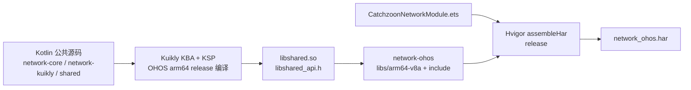
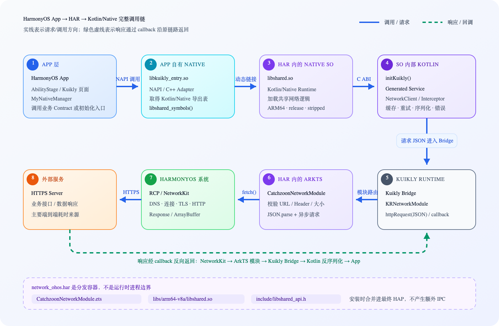
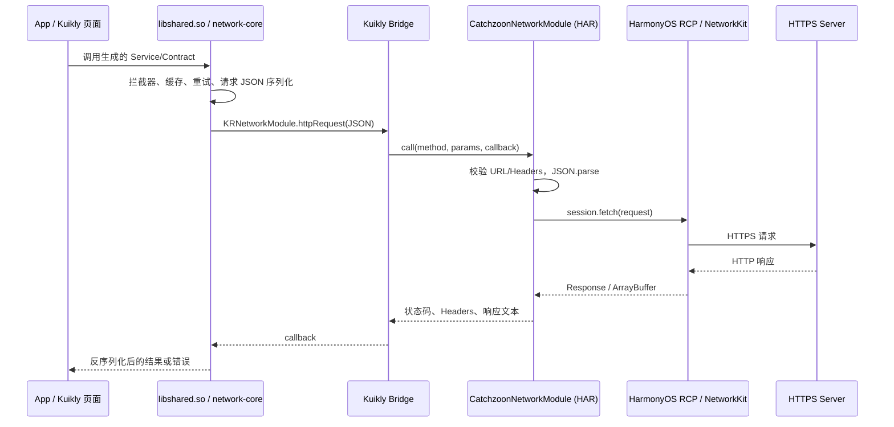

# HarmonyOS HAR 产出、调用链与性能说明

## 1. 最终交付物

网络库对鸿蒙接入方只发布 `network_ohos.har`。HAR 同时携带：

- `CatchzoonNetworkModule`：ArkTS 实现的 Kuikly `KRNetworkModule`，底层使用 HarmonyOS RCP/NetworkKit。
- `libs/arm64-v8a/libshared.so`：由 Kotlin/Native 编译的共享网络逻辑、生成的 Contract 实现和示例业务入口。
- `include/libshared_api.h`：App 自有 NAPI SO 链接 `libshared.so` 时使用的 Kotlin/Native C 头文件。

HAR 是分发容器，不是一个运行时进程。安装 App 时，HAR 中的 ArkTS 字节码和原生库会合并进最终
HAP，因此不会因为“经过 HAR”增加一次 IPC 或网络跳转。

当前只产出 `arm64-v8a`。如果需要 x86_64 模拟器或其他 ABI，必须先为对应 OHOS target 生成 SO，
再放到 HAR 的同名 ABI 目录；只有 arm64 SO 的 HAR 不能在 x86_64 模拟器上加载。

## 2. 构建环境

- DevEco Studio 和匹配的 OpenHarmony SDK。
- JDK、Kotlin KBA 和 Kuikly 依赖由当前工程脚本与 vendor 工程管理。
- 默认从 `/Applications/DevEco-Studio.app` 查找 DevEco Studio；其他位置可设置
  `DEVECO_STUDIO_HOME`。
- 也可以直接设置 `OHOS_SDK_HOME=/path/to/openharmony`。

## 3. 一条命令产出 HAR

在仓库根目录执行：

```bash
./scripts/build_harmony.sh har
```

脚本按以下顺序执行：



输出位置：

```text
network-ohos/build/default/outputs/default/network_ohos.har
```

脚本会在结束前检查 HAR 内必须存在：

```text
package/libs/arm64-v8a/libshared.so
package/include/libshared_api.h
```

也可以手动查看包内容。当前 HAR 是 gzip 压缩的 tar 包，不是 zip：

```bash
tar -tzf network-ohos/build/default/outputs/default/network_ohos.har
```

不带参数的原命令仍然构建 debug 示例 HAP：

```bash
./scripts/build_harmony.sh
```

## 4. App 接入

本地 HAR 可以在 App 的 `oh-package.json5` 中这样声明：

```json5
{
  "dependencies": {
    "@catchzoon/network-ohos": "file:../network_ohos.har"
  }
}
```

随后运行 `ohpm install`。Kuikly 宿主注册 HAR 导出的模块：

```typescript
import { CatchzoonNetworkModule } from '@catchzoon/network-ohos';

map.set(CatchzoonNetworkModule.MODULE_NAME, () => new CatchzoonNetworkModule());
```

`@kuikly-open/render` 已由 HAR 声明为依赖。宿主仍负责 Kuikly 的 Ability、RenderAdapter 和
App 自有 NAPI 入口；这些属于应用配置，不适合固化进通用网络 HAR。

App 自有 NAPI SO 可以从 `oh_modules` 中已安装的 HAR 位置链接预编译库：

```cmake
set(NETWORK_HAR_PATH
    ${CMAKE_CURRENT_SOURCE_DIR}/../../../oh_modules/@catchzoon/network-ohos)
include_directories(${NETWORK_HAR_PATH}/include)
add_library(kuikly_shared SHARED IMPORTED)
set_target_properties(kuikly_shared PROPERTIES
    IMPORTED_LOCATION ${NETWORK_HAR_PATH}/libs/${OHOS_ARCH}/libshared.so)
target_link_libraries(kuikly_entry PUBLIC kuikly_shared)
```

`network-ohos/build-profile.json5` 的 `nativeLib.headerPath` 会让 Hvigor 把 C 头文件放进 HAR 的
`include` 目录。该配置遵循 HarmonyOS 的
[预构建库快速链接](https://developer.huawei.com/consumer/cn/doc/doccenter-deveco-studio/ide-hvigor-so)机制。

## 5. 运行时调用链

下面这张图同时标出了产物归属、初始化调用、网络请求方向和响应回调方向：



### 5.1 App 初始化 Kotlin/Native 业务入口

`libkuikly_entry.so` 是 App 自有 NAPI SO，`libshared.so` 由 HAR 携带。App 的 NAPI SO 从安装后的
HAR 目录取得头文件和库并完成链接：

严格来说，CPU 不会“调用 HAR”：HAR 在安装时已经被展开。图中的 HAR 表示代码与 SO 的归属和
分发关系，真正的 native 调用是 `libkuikly_entry.so -> libshared.so -> Kotlin 函数`。

### 5.2 一次网络请求

当前网络请求从 Kotlin 共享层发起，再通过 Kuikly 模块路由到 HAR 的 ArkTS NetworkKit 实现：



## 6. 延迟和其他影响

| 环节 | 影响 | 结论/建议 |
| --- | --- | --- |
| HAR 本身 | 仅构建、分发和安装时解包 | 没有运行时 IPC，也没有“多一层 HAR 调用”的延迟 |
| 首次加载 SO | 动态链接器加载 `libshared.so`，Kotlin/Native runtime 初始化 | 一次性启动成本；避免在首帧关键路径重复初始化 |
| `libkuikly_entry.so -> libshared.so` | 普通进程内动态函数调用 | 没有线程/进程切换，相比网络 I/O 通常可忽略 |
| ArkTS/Kuikly/NAPI 边界 | 固定调用开销和参数转换 | 不要把一次请求拆成大量细粒度跨层调用 |
| JSON 序列化与字符串/ArrayBuffer 转换 | 时间和内存均随正文大小线性增长，并可能产生临时副本 | 这是跨层主要 CPU/内存成本；大文件应改为二进制或流式专用 Engine |
| RCP/NetworkKit 和 HTTPS | DNS、建连、TLS、服务端耗时 | 通常是端到端延迟的主要部分 |
| 每请求一个 `rcp.Session` | 当前实现请求结束后关闭 Session | 可能降低连接池和 TLS 连接复用；高频小请求需要实机压测后再改成长生命周期 Session |
| HAR 中的 SO | 增加安装包和下载体积 | release 构建开启尺寸优化与无用节裁剪；发布前仍应记录最终 HAR/HAP 大小 |

2026-08-05 的本机验证构建中，未 strip 的 release `libshared.so` 约 8.3 MiB，HAR 内 strip 后约
3.4 MiB，gzip 压缩后的完整 HAR 约 1.1 MiB。这只是当前源码和工具链的样本，不应当作为后续版本
固定的体积指标。

当前桥接默认限制响应体为 2 MiB，允许的最大配置值为 20 MiB。限制避免了异常响应无限占用内存，
但它不能消除大 JSON 在 Kotlin、Kuikly 和 ArkTS 之间的解析与复制成本。

结论：普通 API 请求中，HAR 和 SO 间的 native 函数调用不是性能瓶颈；更值得关注的是首次初始化、
JSON 大对象复制、每请求创建 Session，以及真实网络和服务端耗时。性能判断应以 release 包在真机上的
首请求与持续请求数据为准，不建议用 debug 包或模拟器数据外推。

## 7. 发布前检查

1. 使用 `./scripts/build_harmony.sh har`，不要把 debug SO 当作发布产物。
2. 检查 HAR 内存在 `package/libs/arm64-v8a/libshared.so` 和 `package/include/libshared_api.h`。
3. 在干净的鸿蒙 App 中通过本地 HAR 安装一次，避免只依赖仓库内的 `file:../../network-ohos` 源码路径。
4. 在 arm64 真机验证首次启动、一次成功请求、超时、取消和大响应拒绝。
5. 记录 HAR 大小、最终 HAP 大小、首请求耗时和连续请求 P50/P95。
6. 发布到 OHPM 前更新 `network-ohos/oh-package.json5` 的版本号和变更记录。

## 8. 当前边界

- 这是 Kuikly 的 HarmonyOS 网络适配 HAR，不是面向纯 ArkTS 项目的通用 HTTP Client。
- Bridge 当前只支持 JSON 文本请求；二进制、下载、上传流和证书 Pin 需要鸿蒙专用
  `NetworkEngine`。
- App 自有的 `libkuikly_entry.so` 不进入网络 HAR，因为其中包含字体、图片、文本处理等宿主级
  Adapter。网络 HAR 只携带可复用的 ArkTS 网络模块和 Kotlin/Native `libshared.so`。
